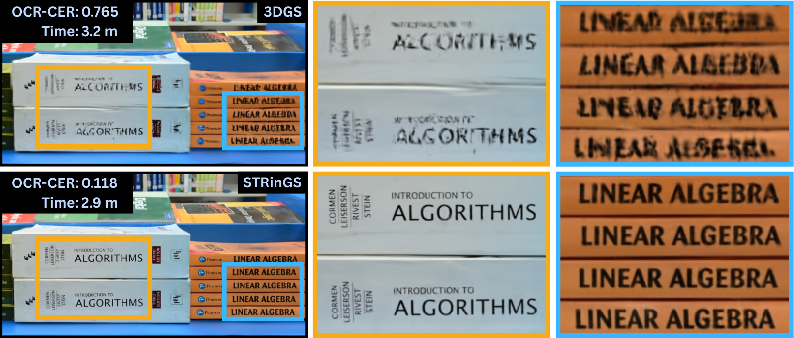

    <h1>STRinGS: Selective Text Refinement in Gaussian Splatting 
        WACV 2026
    </h1>
    

        <a href="https://www.linkedin.com/in/abhinav-raundhal/">Abhinav Raundhal*</a>,
        <a href="https://www.linkedin.com/in/gauravbehera/">Gaurav Behera*</a> 
        <a href="https://faculty.iiit.ac.in/~pjn/">P. J. Narayanan</a>,
        <a href="https://ravika.github.io/">Ravi Kiran Sarvadevabhatla</a>,
        <a href="https://makarandtapaswi.github.io/">Makarand Tapaswi</a>
    

    

        
        
        
    

  
   
  <em>STRinGS (bottom) produces sharper and readable text
as compared to vanilla 3DGS (top)</em>

## 📢 Announcements
* [Dec 25 2025] 🎁 STRinGS-360 Dataset is now available! <a href="https://drive.google.com/drive/folders/19hgxxiqQNRYgqhvVhgflq7GIZu-RgIN3?usp=sharing">Download here</a>.
* [Dec 12 2025] 🔗 Project Page is live! Check it out <a href="https://STRinGS-official.github.io/">here</a>.
* [Nov 9 2025] 🎉 Paper accepted to WACV 2026!

Code to be released soon. Stay tuned!

